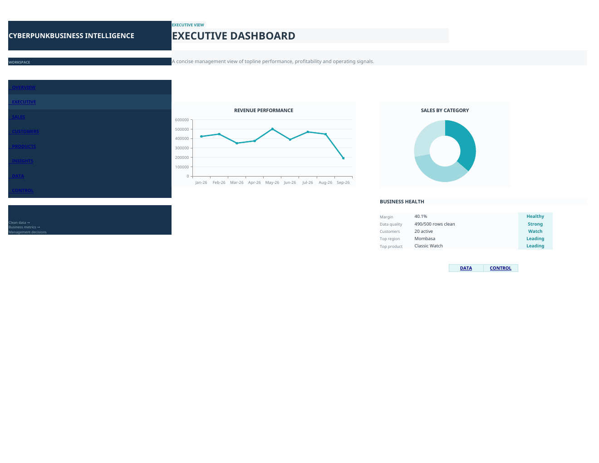
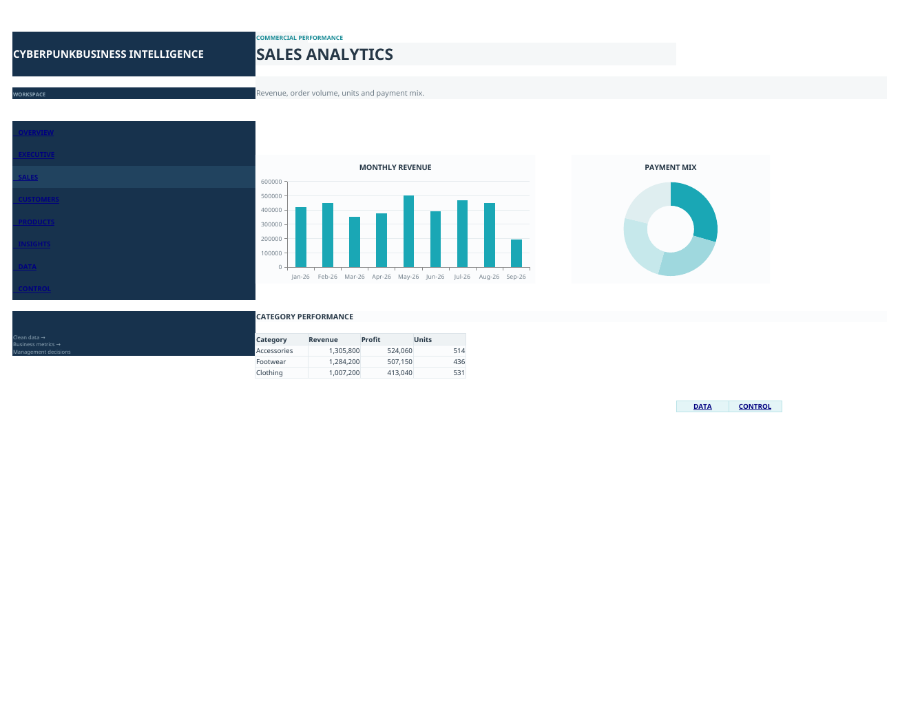
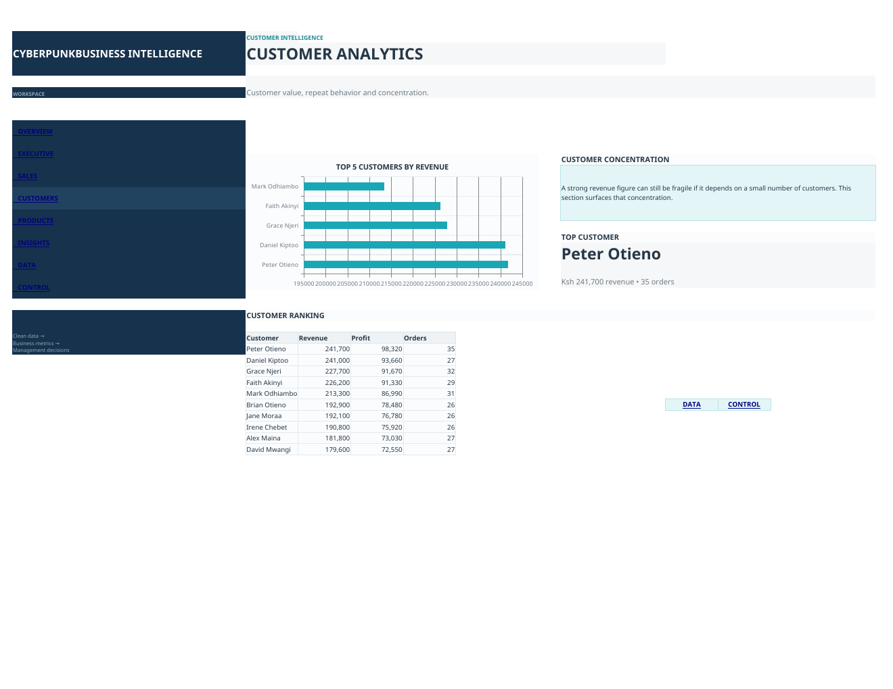
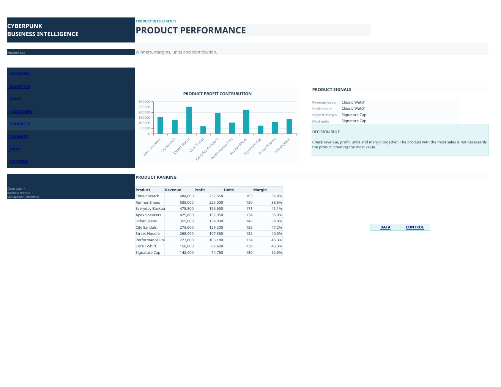
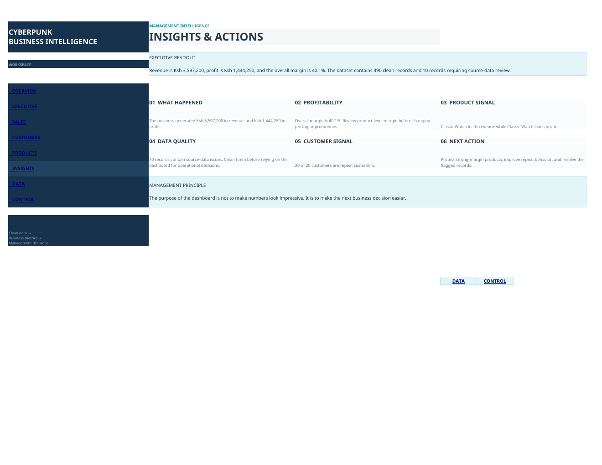
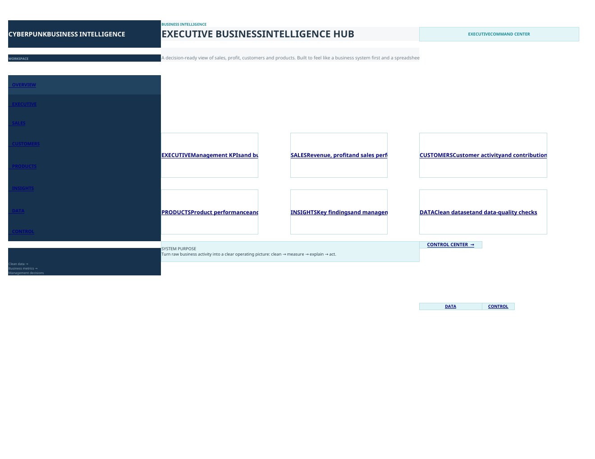

# Executive Business Intelligence Hub | Excel Dashboard



A premium Excel-based business intelligence dashboard designed to transform structured sales data into a management-ready reporting environment.

Built as a personal portfolio project using sample data, the system brings sales, customer, product, profitability, data-quality, and management insights into one structured Excel workbook.

## Project Overview

This project demonstrates how Microsoft Excel can be used to create a complete business intelligence reporting environment rather than a basic spreadsheet.

The workbook is organized into separate layers for:

- Raw data
- Cleaned data
- Analytical calculations
- Executive reporting
- Sales analysis
- Customer analysis
- Product analysis
- Data-quality control
- Management insights

The goal was to create a dashboard that allows a decision-maker to move from high-level business performance to detailed analysis without navigating through disconnected spreadsheets.

## Project Role

Data Analyst & Excel Dashboard Developer

## Dataset

The project uses a structured sample sales dataset containing:

- 500 sales/order records
- 20 customers
- 10 products
- 3 product categories
- 500 unique order IDs
- Data period: 2 January 2026 – 15 September 2026

## Key Portfolio Metrics

The dashboard presents the following sample-data results:

| Metric | Result |
|---|---:|
| Revenue | KSh 3,597,200 |
| Profit | KSh 1,444,250 |
| Profit Margin | 40.1% |
| Customers | 20 |
| Products | 10 |
| Categories | 3 |
| Records | 500 |
| Records marked OK | 490 |
| Records requiring review | 10 |

These figures belong to the sample dataset used for the portfolio project and are not presented as client or business results.

## Dashboard Structure

### Executive Dashboard

The executive view provides a management-level summary of:

- Revenue
- Profit
- Profit margin
- Customer activity
- Data quality
- Top-performing regions
- Top-performing products


### Sales Analytics

The sales analysis view examines:

- Revenue trends
- Monthly performance
- Payment mix
- Category performance
- Sales distribution



### Customer Analytics

The customer analysis view examines:

- Customer ranking
- Revenue contribution
- Order activity
- Customer concentration
- Repeat-customer behavior



### Product Performance

The product analysis view examines:

- Product revenue
- Profit contribution
- Product margins
- Product ranking
- Category contribution



### Insights & Actions

The insights layer translates the dashboard findings into management-oriented observations and recommended actions.



### Home / Navigation

The workbook includes a dedicated home interface that provides structured navigation between the major reporting areas.



## Workbook Architecture

```text
Excel Executive Business Intelligence Hub
│
├── HOME
│   └── Dashboard navigation and project overview
│
├── EXECUTIVE
│   └── Management-level KPI dashboard
│
├── SALES
│   └── Sales performance analysis
│
├── CUSTOMERS
│   └── Customer performance analysis
│
├── PRODUCTS
│   └── Product performance analysis
│
├── INSIGHTS
│   └── Findings and management actions
│
├── CONTROL
│   └── KPI definitions and data-quality controls
│
├── DATA_RAW
│   └── Source dataset
│
├── DATA_CLEAN
│   └── Structured analytical dataset
│
└── CALCS
    └── Analytical support layer
```

## Data Quality

Data quality was treated as part of the reporting system rather than an afterthought.

The workbook identifies:

- 490 records marked as OK
- 10 records requiring source-data review
- Unique order IDs
- Customer and product coverage
- Data-period coverage
- Structured raw and cleaned data layers

This allows the dashboard user to understand not only the reported numbers, but also the quality status of the underlying dataset.

## Example Business Insights

The sample dashboard surfaces findings such as:

- Overall profit margin of 40.1%
- Mombasa identified as the top region in the dashboard
- Classic Watch identified as the leading product by revenue
- Signature Cap identified as having the highest product margin
- 20 of 20 customers represented as repeat customers
- 10 records flagged for source-data review

These findings demonstrate how structured reporting can move beyond displaying numbers toward supporting business decisions.

## Skills Demonstrated

### Microsoft Excel

- Dashboard development
- Spreadsheet architecture
- Data organization
- KPI reporting
- Structured reporting systems
- Professional dashboard presentation

### Data Analysis

- Sales analysis
- Customer analysis
- Product analysis
- Profitability analysis
- KPI interpretation
- Performance comparison
- Trend analysis

### Data Cleaning & Quality

- Raw-data organization
- Clean-data structuring
- Data-quality status checks
- Record validation
- Data consistency review

### Business Intelligence

- Executive reporting
- KPI design
- Management dashboards
- Business-performance analysis
- Insight communication
- Decision-oriented reporting

### Data Visualization

- Dashboard layout
- KPI cards
- Charts
- Comparative visualizations
- Management-oriented information design

## Project Objective

The objective was to build an Excel system that feels closer to a small business intelligence application than a conventional spreadsheet.

The design focuses on:

- Clear information hierarchy
- Fast executive understanding
- Consistent reporting
- Structured data layers
- Data-quality visibility
- Professional presentation
- Action-oriented insights

## Portfolio Value

This project demonstrates practical ability to take a structured dataset and turn it into a professional analytical reporting environment.

It provides evidence of practical experience with:

`Microsoft Excel` · `Data Analysis` · `Data Cleaning` · `Data Visualization` · `Business Intelligence` · `Dashboard Design` · `KPI Reporting`

## Repository Contents

```text
excel-executive-business-intelligence-hub/
│
├── README.md
├── DATA_DICTIONARY.md
├── LICENSE.txt
├── .gitignore
│
├── workbook/
│   └── Executive_Business_Intelligence_Hub.xlsx
│
└── screenshots/
    ├── 01-home-overview.png
    ├── 02-executive-dashboard.png
    ├── 03-sales-analytics.png
    ├── 04-customer-analytics.png
    ├── 05-product-performance.png
    └── 06-insights-actions.png
```

## How to Use

1. Download the Excel workbook from the `workbook` directory.
2. Open it in Microsoft Excel.
3. Start from the `HOME` sheet.
4. Navigate through the executive, sales, customer, product, and insights views.
5. Review the `CONTROL` sheet for KPI and data-quality information.
6. Inspect `DATA_RAW` and `DATA_CLEAN` to understand the underlying dataset structure.

## Project Scope & Honesty Note

This is a personal portfolio project created using sample/demo data.

It is not presented as paid client work and the displayed business metrics are not claimed as real client results.

This specific project demonstrates Excel, data analysis, data cleaning, data visualization, business intelligence, dashboard design, KPI reporting, and management insight communication.

Technologies such as Power BI, SQL, Python, n8n, APIs, and advanced AI automation are intentionally not claimed as technologies used in this project.

## Future Development

Potential future extensions could include:

- Power BI implementation
- Automated data refresh
- Advanced Excel transformation workflows
- SQL-backed analytics
- Python-based data processing
- API-connected reporting
- AI-assisted business intelligence

These are future development directions and are not part of the current project.

## Author

Brian Maobe Onyancha

Data, Business Intelligence, AI & Automation

---

⭐ This repository is part of my professional portfolio demonstrating practical data analytics and business intelligence work.
